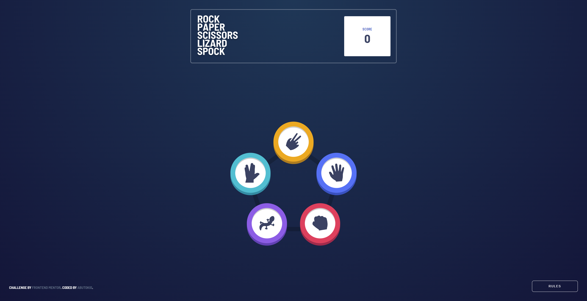
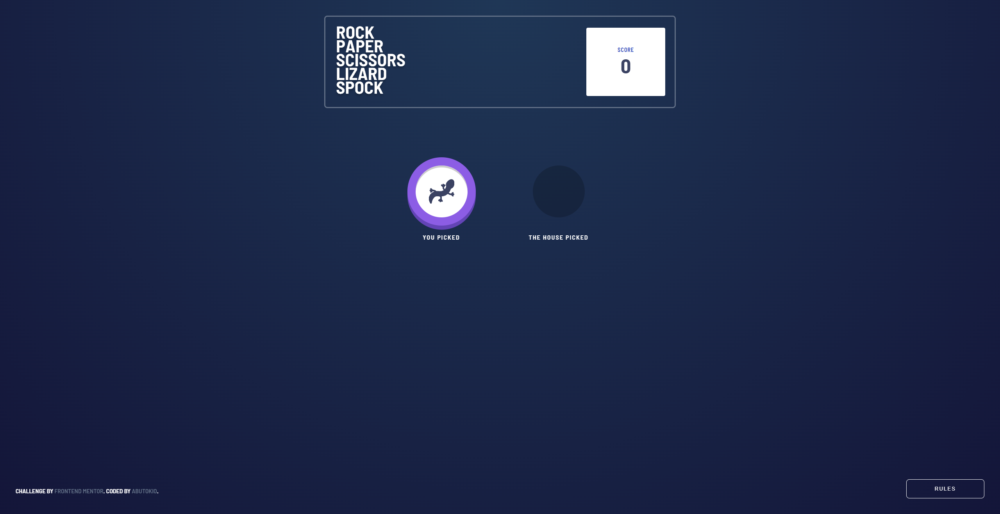
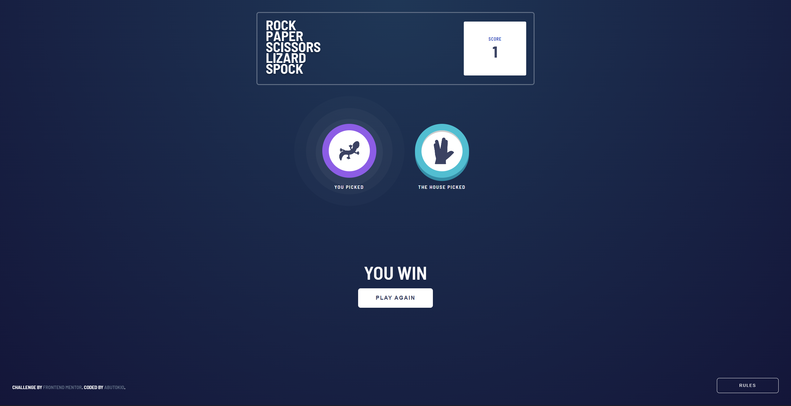
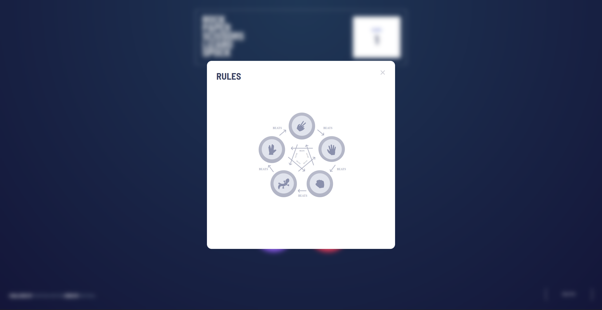

# Frontend Mentor - Rock, Paper, Scissors solution

This is a solution to the [Rock, Paper, Scissors challenge on Frontend Mentor](https://www.frontendmentor.io/challenges/rock-paper-scissors-game-pTgwgvgH). Frontend Mentor challenges help you improve your coding skills by building realistic projects. In my case, part of the SuperCode bootcamp I am attending was to create a “Rock, Paper, Scissors” project, so I decided to combine the Frontend Mentor challenge with my bootcamp assignment.

## Table of contents

- [Overview](#overview)
  - [The challenge](#the-challenge)
  - [Screenshot](#screenshot)
  - [Links](#links)
- [Built with](#built-with)
- [Author](#author)
- [Acknowledgments](#acknowledgments)

## Overview

### The challenge

Users should be able to:

- View the optimal layout for the game depending on their device's screen size
- Play Rock, Paper, Scissors against the computer
- Maintain the state of the score after refreshing the browser _(optional)_
- **Bonus**: Play Rock, Paper, Scissors, Lizard, Spock against the computer _(optional)_

### Screenshot

### Links

- Solution URL: [rock-paper-scissors-lizard-spock](https://github.com/AbuTokio/rock-paper-scissors-lizard-spock)
- Live Site URL: [tbd]()

## Built with

- Semantic HTML5 markup
- CSS custom properties
- CSS Animations
- Flexbox
- Mobile-first workflow
- [Typescript](https://www.typescriptlang.org/)
- [Vite](https://vite.dev/)

## Author

- Github - [AbuTokio](https://github.com/AbuTokio)
- Frontend Mentor - [@AbuTokio](https://www.frontendmentor.io/profile/AbuTokio)

## Acknowledgments

At this point, I would like to thank [FaridTvk](https://github.com/FaridTvK) and [EmmoCodes](https://github.com/EmmoCodes) once again. They are doing a great job at SuperCode. Thanks for the knowledge you shared so far.
